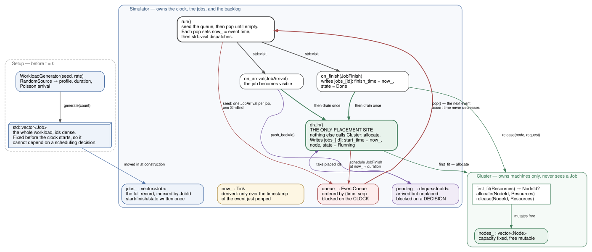

# Atlas

[](https://github.com/N0ck0/atlas-simulator/actions/workflows/ci.yml)

A discrete-event simulator for experimentally evaluating datacenter scheduling policies.

> **Status: in development.** Stages 1 to 3 are complete — the simulator runs end to
> end, compares eight scheduling configurations over a seed sweep, reports metrics,
> emits a deterministic trace, and is covered by 103 tests across four build
> configurations in CI. Everything else on the roadmap is not implemented; unchecked
> boxes mean exactly that.

## What this is

You describe a hypothetical datacenter — nodes, racks, network topology — submit a
workload, plug in a scheduling policy, and measure what happens: job completion time,
queueing delay, resource utilization, network congestion.

The point is *not* to run a thousand containers. It is to model what would happen if
you did, fast enough to sweep hundreds of configurations and answer questions like:

> How much does incorporating network topology into scheduling improve job completion
> time under communication-heavy workloads — and what does it cost under CPU-heavy ones?

Simulated time advances by jumping from event to event rather than ticking forward,
so hours of datacenter activity run in seconds of wall-clock time.

## Architecture

```
              Python  ──  experiments, analysis, dashboard        (S6)
                 │
                 │  pybind11
                 ▼
              libatlas  (C++20)
                 │
     engine/  clock, ids, events, event queue, simulator
     model/   resources, nodes, jobs, cluster, random, workload
     metrics/ load factor, utilization integral, percentiles
     io/      CLI options, JSONL trace, run report
     net/     topology, flows, bandwidth sharing                  (S5)
     sched/   placement policies + queue policies (backfill)
```

`libatlas` is a static library; `src/main.cpp` is a thin CLI on top of it. Everything
lives in a flat `namespace atlas`, and includes are written from `src/` down, so a
header's path names its module:

```cpp
#include "atlas/engine/event_queue.hpp"
```

Directories marked with a stage do not exist yet.

[](docs/architecture.svg)

Who owns what and how work moves during a run — the event spine, the two
scheduling interfaces, and what each layer is allowed to see. Open the image for
a readable copy; [`docs/job-lifecycle.svg`](docs/job-lifecycle.svg) is the
companion view of a single job's states. Both render from the `.dot` sources
beside them with `dot -Tsvg`.

## Roadmap

- [x] **S1** Vertical slice — event queue, clock, nodes, jobs, first-fit placement
- [x] **S2** CMake, GoogleTest, CI, golden-trace determinism test
- [x] **S3** Pluggable scheduler + queue policies (FIFO, EASY backfill) + metrics
- [ ] **S4** Live terminal dashboard (FTXUI)
- [ ] **S5** Network fabric with max-min fair bandwidth sharing
- [ ] **S6** YAML config, pybind11 bindings, Python experiment harness
- [ ] **S7** DAG workloads, services, failure injection, migration
- [ ] **S8** Web dashboard, Docker, release

## Building and running

Requires a C++20 compiler, CMake 3.25+, and Ninja.

```bash
cmake --preset debug          # also: release, asan
cmake --build --preset debug
./build/debug/atlas           # one simulation at the default operating point
```

There is a `Makefile` for the commands you type most. It is a wrapper — every recipe
forwards to `cmake` or `ctest`, and no build setting lives in it — so the two are
interchangeable:

```bash
make            # build the debug preset
make test       # the test suite: 103 GoogleTest cases
make asan       # build with ASan + UBSan
make help       # every target
```

`make sim` runs one simulation with a report, and takes overrides for any parameter, so
an operating point can be swept without a recompile:

```bash
make sim NODES=16 RATE=0.035
```

A run reports what the cluster actually did, next to what was asked of it:

```
run: seed 7  nodes 8  jobs 2000  rate 0.025/s  scheduler first_fit  queue fifo
  span               81161.9s
  offered rho   cores 0.6209  memory 0.6144
  utilization   cores 0.6025  memory 0.5962
  backfilled               0 of 2000 jobs
  turnaround    p50   1258.8s  p95   2745.3s  p99   3642.9s  (0 censored)
  queue wait    p50    980.6s  p95   2228.2s  p99   2487.8s  (0 censored)
```

`offered rho` is the demand the workload places on the cluster; `utilization` is the
time-weighted fraction actually consumed. They track closely when the cluster keeps
up, and diverge when it cannot. Percentiles rather than means because the
distributions are skewed. Two flags select the policy, because a scheduling decision
has two independent halves: `--scheduler` picks the node (`first_fit`, `round_robin`,
`least_loaded`, `resource_aware`) and `--queue` picks the job (`fifo`, `backfill`).

`backfill` is EASY backfill: when the job at the head of the queue does not fit, a job
further back may start ahead of it provided it is predicted to finish before the head's
reservation. That prediction uses a **walltime estimate**, not the true duration —
`--padding F` controls how far users over-claim, with estimates drawn uniformly from
1× to (1+F)× the real service time. Planning against the true duration would be the
scheduler reading a future it cannot know, so `QueuedJob` does not expose it.

## Comparing schedulers

`--compare` runs every policy over the same set of seeds and prints a table. Each
scheduler sees the identical workload on each seed, which is what makes the last
column meaningful:

```
compare: seeds 7..36  nodes 8  jobs 2000  rate 0.025/s
  offered rho   cores 0.6155  memory 0.6041  (mean over 30 seeds)

  queue/scheduler            util    p95 turn       sd   p95 queue      paired delta   wins  backfil
                            cores    mean (s)      (s)    mean (s)    mean (s) +- se
  fifo/first_fit           0.5952      2688.7   1217.6      2084.8          baseline   0/30        0
  fifo/round_robin         0.5953      2682.8   1189.3      2079.5       -6.0 +-  7.9   1/30        0
  fifo/least_loaded        0.5952      2695.9   1194.5      2093.1       +7.1 +-  7.9   0/30        0
  fifo/resource_aware      0.5953      2675.9   1187.1      2072.5      -12.8 +-  7.3   0/30        0
  backfill/first_fit       0.5957      2592.4   1119.3      1753.6      -96.3 +- 23.6  10/30      697
  backfill/round_robin     0.5957      2603.6   1119.3      1755.5      -85.1 +- 23.3   5/30      702
  backfill/least_loaded    0.5956      2607.0   1125.0      1759.4      -81.7 +- 21.9   6/30      708
  backfill/resource_aware  0.5957      2593.5   1118.5      1746.5      -95.2 +- 23.9   8/30      695
```

A row is a (queue policy, placement policy) pair, because the two are
independent choices and only their product answers which one matters.

The two spread columns measure different things. `sd` is the variation in p95
turnaround *across seeds*, and at ~1200s it is dominated by how much one random
workload differs from another — nothing to do with scheduling. `± se` is the
uncertainty on the *paired* difference: because both policies ran the same workload
on each seed, subtracting them cancels that seed's difficulty, and what remains is
the effect of the policy. That is why the same data supports a spread of 1200s and an
uncertainty of 8s at the same time.

Read that way, the top four rows are a **null result**. The best placement policy is
ahead of the baseline by 12.8s ± 7.3s on a p95 of ~2700s — under half a percent, and
under two standard errors. Placement is not distinguishable at this operating point.

The queue policy is. Backfill is 96.3s ± 23.6s ahead of the same baseline — four
standard errors, and the first effect in this project large enough to claim. Its real
effect is bigger than the p95 suggests, because it is concentrated in the body of the
distribution rather than the tail:

| | p50 turnaround | p95 turnaround | p50 queue wait | p95 queue wait |
| --- | --- | --- | --- | --- |
| fifo | 1,258.8s | 2,745.3s | 980.6s | 2,228.2s |
| backfill | 335.7s | 2,711.0s | **23.5s** | 1,967.8s |

Median queue wait falls from sixteen minutes to twenty-four seconds. 796 of 2,000 jobs
started ahead of a blocked head. The p95 barely moves because the jobs that jump the
queue are the small ones, and the tail belongs to the `large` jobs that were blocking
it — which is the tradeoff EASY backfill is supposed to make, visible directly.

## The utilization ceiling, and what it is not

Raising the arrival rate produces a striking flat line:

| offered rho (cores) | achieved utilization | p95 queue wait |
| --- | --- | --- |
| 0.62 | 0.592 | 2,136s |
| 0.74 | 0.636 | 9,448s |
| 0.92 | 0.638 | 20,839s |
| 1.12 | 0.639 | 29,764s |

Offered load nearly doubles and passes 100% of capacity, queue wait grows fourteenfold,
and utilization stops at 0.64. It is tempting to read that as head-of-line blocking —
`large` asks for all 16 of a node's cores, one job in four is `large`, and under FIFO
one of them at the head holds up everything behind it.

**That reading is wrong, and backfill is what disproves it.** Backfill removes
head-of-line blocking — 1,015 of 2,000 jobs jump the queue at rho 1.12 — and the ceiling
does not move: utilization goes from 0.6274 to 0.6319, and the span from 77,944s to
77,390s. Estimate quality is not the limit either; rerunning with `--padding 0`, giving
the scheduler perfect walltime knowledge, changes nothing.

The ceiling is a **packing limit**, not a queueing one. Utilization is work divided by
span, and the work here is fixed at 2,000 jobs: `0.6373 = 1.1176 × 44,444s / 77,944s`
reproduces the measured figure as an identity. Perfectly packed, that work needs
49,671 capacity-seconds; the cluster takes 77,944s of wall time to absorb it. The
missing 36% is multi-dimensional fragmentation — `cache` jobs occupy 75% of a node's
memory and 25% of its cores, `large` needs 100% of the cores, and the two cannot share
a node — and no ordering of the queue can recover it.

So backfill buys **latency, not throughput**: it reorders work within a fixed
completion span. Lifting the ceiling needs a different lever — heterogeneous node
sizes, or a job mix whose dimensions do not conflict — which is a workload and topology
question, not a scheduling one.

One prediction that did **not** survive: placement was expected to start mattering once
backfill removed the queue bottleneck, since packing policies should leave larger
contiguous gaps. The four backfill rows span 81.7s to 96.3s against standard errors of
roughly 23s. They are still indistinguishable.

## Trace format

`--trace PATH` writes a JSONL file — one JSON object per line, so it streams into
pandas and diffs cleanly:

```jsonl
{"ev":"header","seed":7,"nodes":8,"jobs":2000,"arrival_rate":0.025,"scheduler":"first_fit","queue":"fifo","padding":2}
{"ev":"job","job":0,"submit":85681869,"dur":1560874,"est":3092048,"cores":1,"mem_mb":2048}
{"t":85681869,"seq":0,"ev":"JobArrival","job":0}
{"t":85681869,"ev":"JobStart","job":0,"node":0}
{"t":87242743,"seq":2000,"ev":"JobFinish","job":0,"node":0}
```

Times are integer microseconds, never floating point. A `job` record per job carries
the static workload — including `est`, the user's walltime claim, recorded separately
from `dur` so an analysis can see how wrong it was; the timestamped records are what
happened. `JobStart` has no
`seq` because placement is not an event — it is a decision made inside a handler —
so file order, not the `seq` field, orders records sharing a timestamp.

The same seed produces a byte-identical trace regardless of compiler or optimization
level. One run's complete trace is checked into `tests/golden/`, and the `golden_trace`
test regenerates it and compares byte for byte:

```bash
make determinism   # the golden trace under debug, release and asan
```

CI runs the same comparison across gcc and clang at `-O0` and `-O3`, so a trace that
shifts under any of them fails the build. That property is what makes an experimental
result reproducible rather than anecdotal. When a change to the trace is intended,
`make golden-update` regenerates the file — after reading the diff, never before.

## License

Not yet chosen.
